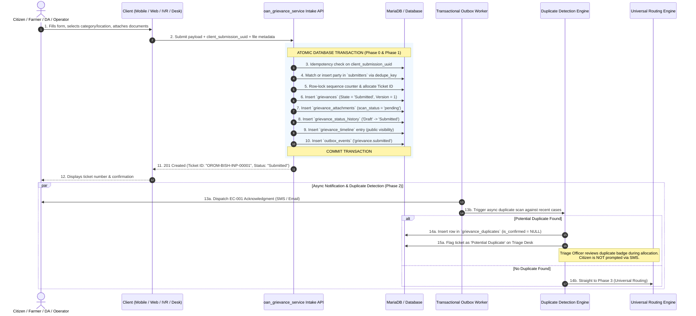
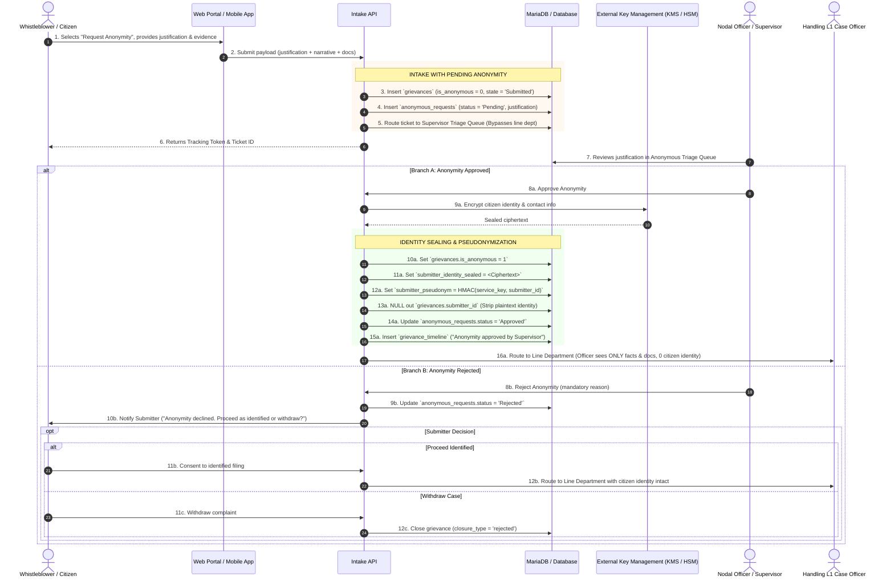

# Grievance Intake, Document Submission & Duplicate Flagging Specification

This document provides the end-to-end operational and architectural specification for **Phase 0 (Identity Resolution)**, **Phase 1 (Intake & Document Submission)**, and **Phase 2 (Duplicate Detection & Flagging)** in `oan_grievance_service`.

It details the generic lifecycle, channel-specific intake variations, the exact database row operations (created/updated), and the non-blocking duplicate detection engine.

---

## 1. End-to-End System Sequence Diagram



---

## 2. Channel-by-Channel Intake Flows

### Channel 1: Mobile App (Direct Farmer / Citizen Self-Service)

- **Mode:** Online & Offline Sync.
- **Actor & Ownership:** Submitter is the record owner (`submitter_id = <farmer_id>`). `filed_by_user_id = NULL`.
- **Idempotency:** Client generates `client_submission_uuid` on-device before sync.
- **Flow Walkthrough:**
  1. Citizen logs in via external identity provider (Fayda / GEN2 OAuth / OTP).
  2. Citizen selects incident location (Administrative Area leaf node), Service Category, and Grievance Type.
  3. Citizen captures and attaches supporting evidence (photos of land deeds, receipt, crop failure).
  4. Mobile app computes SHA-256 checksums and uploads binaries to storage.
  5. Intake API validates payload, resolves submitter by Fayda ID/phone, allocates gapless ticket number, and inserts grievance and document attachment rows.
  6. Citizen receives on-screen ticket confirmation.

---

### Channel 2: Web Portal (Citizen Self-Service / Optional Anonymity)

- **Mode:** Responsive Web Browser.
- **Actor & Ownership:** Submitter is the record owner (`submitter_id`).
- **Anonymity Flow:** If citizen opts for anonymity:
  - `grievances.is_anonymous` remains `0` (unapproved) at intake.
  - An `anonymous_requests` row is inserted capturing citizen's justification (e.g. fear of reprisal).
  - Triage officer reviews anonymity request before public routing.
- **Flow Walkthrough:**
  1. Citizen enters contact data (or requests anonymity) and enters complaint details.
  2. Citizen uploads PDF/image documents.
  3. System resolves party, generates ticket ID, stores attachments, and emits `grievance.submitted`.
  4. Citizen receives tracking token and portal link.

---

### Channel 3: DA-Assisted (Development Agent on Field Tablet)

- **Mode:** Staff-Assisted Field Intake.
- **Actor & Ownership:** The **Farmer** owns the case (`submitter_id = <farmer_id>`). The **DA** is the operator of record (`filed_by_user_id = <da_user_id>`).
- **Flow Walkthrough:**
  1. DA authenticates into the field app with their staff account (`Role: Development Agent`).
  2. DA searches for or registers the farmer using their Fayda ID, Farmer ID, or Phone.
  3. DA fills out grievance narrative and uses tablet camera to photograph farmer's physical documents.
  4. Submission bundle carries both citizen identity and DA user ID.
  5. System creates/updates farmer in `submitters`, sets `grievances.filed_by_user_id = <da_user_id>`, and flags attachments with `uploaded_by_user_id = <da_user_id>`.
  6. Farmer receives an **EC-001** SMS in their preferred language (`am`/`en`). DA sees the ticket in their field submission log.

---

### Channel 4: Call Centre / Helpline Operator (Voice-Assisted)

- **Mode:** Inbound Telephone Hotline.
- **Actor & Ownership:** Citizen is `submitter_id`; Call Centre Operator is `filed_by_user_id`.
- **Flow Walkthrough:**
  1. Citizen dials toll-free hotline. Operator opens intake screen in Frappe Desk.
  2. Operator enters caller phone number; system auto-pulls previous submitter profile.
  3. Operator transcribes verbal complaint. If documents exist, operator sends an SMS upload link or advises the citizen to bring copies to the woreda office.
  4. Operator submits record with `channel = 'call_centre'`.
  5. System allocates ticket ID, writes grievance, and logs call summary to `grievance_timeline`.
  6. Caller receives an automated SMS with their Ticket ID.

---

### Channel 5: IVR / Telephony (Automated Voice Recording)

- **Mode:** Unassisted Interactive Voice Response.
- **Actor & Ownership:** Submitter resolved by Caller ID (`phone:<caller_num>`); `filed_by_user_id = NULL`.
- **Flow Walkthrough:**
  1. Citizen calls after hours, navigates keypad prompts (Language $\rightarrow$ Region $\rightarrow$ Category), and records audio complaint.
  2. Telephony server saves audio file (`.wav`) to object storage.
  3. Telephony webhook sends caller phone, IVR selections, and audio file key to intake API.
  4. System resolves submitter, allocates ticket ID, creates grievance with `channel = 'ivr'`, and inserts audio recording as a `grievance_attachments` row (`document_type = 'voice_recording'`).
  5. System sends SMS with ticket tracking number to caller.

---

### Channel 6: Walk-in / Woreda Front Desk (Physical Paper Ingestion)

- **Mode:** In-person Office Intake.
- **Actor & Ownership:** Citizen is `submitter_id`; Front Desk Officer is `filed_by_user_id`.
- **Flow Walkthrough:**
  1. Citizen presents physical paper documents (ID, landholding certificate, receipts) at the Woreda office.
  2. Clerk enters citizen details and complaint narrative into Desk.
  3. Clerk scans physical documents and attaches PDFs to the submission.
  4. System registers submitter, inserts grievance, and creates `grievance_attachments` records.
  5. System sends SMS to citizen and prints a paper acknowledgment receipt with barcode and Ticket ID.

---

## 3. Database Row Operations Matrix (Phase 0, 1 & 2)

| Step                            | Database Table             |              DB Operation              | Key Columns Populated / Mutated                                                                                                                                                                                                                                                                                                                                                                                                                                                                                                                                                                                                                                                                                                                                                                                                                                                 |
| ------------------------------- | -------------------------- | :------------------------------------: | ------------------------------------------------------------------------------------------------------------------------------------------------------------------------------------------------------------------------------------------------------------------------------------------------------------------------------------------------------------------------------------------------------------------------------------------------------------------------------------------------------------------------------------------------------------------------------------------------------------------------------------------------------------------------------------------------------------------------------------------------------------------------------------------------------------------------------------------------------------------------------- |
| **Phase 0: Party Resolution**   | `submitters`               |      **SELECT / INSERT / UPDATE**      | • `id` (UUIDv7 PK)<br/>• `dedupe_key` (`fayda:123...` or `phone:+251...`)<br/>• `submitter_type_id` (FK → `submitter_types.id`)<br/>• `full_name`, `phone`, `email`, `farmer_id`<br/>• `preferred_language` (`am`, `en`)<br/>• `administrative_area`, `administrative_unit`<br/>• `identity_verified_at` (timestamptz)<br/>• `is_blocked` (checked; aborts if `1`)                                                                                                                                                                                                                                                                                                                                                                                                                                                                                                              |
| **Phase 1: Gapless Counter**    | `sequence_counters`        |        **UPDATE** (Row-Locked)         | • `counter_key` (`OROM-BISH-INP`)<br/>• `current_val` (`current_val + 1`)<br/>• `modified` (`NOW()`)                                                                                                                                                                                                                                                                                                                                                                                                                                                                                                                                                                                                                                                                                                                                                                            |
| **Phase 1: Core Grievance**     | `grievances`               |               **INSERT**               | • `id` (UUIDv7 PK)<br/>• `ticket_id` (`OROM-BISH-INP-00001`)<br/>• `client_submission_uuid` (UQ idempotency key)<br/>• `submitter_id` (FK → `submitters.id`)<br/>• `channel_identity` (e.g. Phone, Email, Telegram chat ID)<br/>• `channel_metadata` (JSON for session context)<br/>• `filed_by_user_id` (FK → `users.id`, or `NULL`)<br/>• `category_id` (FK → `service_categories.id`)<br/>• `grievance_type_id` (FK → `grievance_types.id`)<br/>• `administrative_area_id` (FK → `administrative_areas.id`)<br/>• `kebele`, `facility_name`, `title`, `description`, `expected_resolution`<br/>• `channel` (`mobile_app`, `web_portal`, `da_assisted`, `ivr`, `call_centre`, `walk_in`)<br/>• `state_id` (`'Submitted'`)<br/>• `priority` (`'Medium'` default)<br/>• `language` (`am` / `en`)<br/>• `submitted_at`, `created_at`<br/>• `version` (`1`), `is_escalated` (`0`) |
| **Phase 1: Evidence & Docs**    | `grievance_attachments`    | **INSERT** _(1 row per uploaded file)_ | • `id` (UUIDv7 PK)<br/>• `grievance_id` (FK → `grievances.id`)<br/>• `document_type_id` (FK → `document_types.id`)<br/>• `file_name`, `storage_key`, `mime_type`, `size_bytes`<br/>• `checksum_sha256` (SHA-256 byte hash)<br/>• `scan_status` (`'pending'`)<br/>• `uploaded_by_submitter_id` / `uploaded_by_user_id`                                                                                                                                                                                                                                                                                                                                                                                                                                                                                                                                                           |
| **Phase 1: Anonymity Gate**     | `anonymous_requests`       |      **INSERT** _(If requested)_       | • `id` (UUIDv7 PK)<br/>• `grievance_id` (FK → `grievances.id`)<br/>• `justification` (Text reason)<br/>• `status` (`'Pending'`)<br/>• `created_at`                                                                                                                                                                                                                                                                                                                                                                                                                                                                                                                                                                                                                                                                                                                              |
| **Phase 1: State History**      | `grievance_status_history` |               **INSERT**               | • `id` (UUIDv7 PK)<br/>• `grievance_id` (FK → `grievances.id`)<br/>• `from_state` (`'Draft'`)<br/>• `to_state` (`'Submitted'`)<br/>• `changed_by_user_id` / `submitter_id`<br/>• `created_at`                                                                                                                                                                                                                                                                                                                                                                                                                                                                                                                                                                                                                                                                                   |
| **Phase 1: Timeline Audit**     | `grievance_timeline`       |               **INSERT**               | • `id` (UUIDv7 PK)<br/>• `grievance_id` (FK → `grievances.id`)<br/>• `entry_type` (`'status_change'`)<br/>• `visibility` (`'public'`)<br/>• `content` (`"Grievance submitted via <Channel>"` )<br/>• `created_at`                                                                                                                                                                                                                                                                                                                                                                                                                                                                                                                                                                                                                                                               |
| **Phase 1: Transaction Outbox** | `outbox_events`            |               **INSERT**               | • `id` (UUIDv7 PK)<br/>• `event_name` (`'grievance.submitted'`)<br/>• `aggregate_type` (`'Grievance'`)<br/>• `aggregate_id` (`grievance.id`)<br/>• `payload` (JSON metadata for SMS & Dup Check)<br/>• `status` (`'pending'`)                                                                                                                                                                                                                                                                                                                                                                                                                                                                                                                                                                                                                                                   |
| **Phase 2: Duplicate Flagging** | `grievance_duplicates`     |    **INSERT** _(If match detected)_    | • `id` (UUIDv7 PK)<br/>• `grievance_id` (FK → `grievances.id` of new case)<br/>• `duplicate_of_grievance_id` (FK → existing case)<br/>• `detected_at` (`NOW()`)<br/>• `similarity_score` (Numeric 0.0000 - 1.0000)<br/>• `detection_method` (`'fayda_recent_similar'` / `'text_similarity'`)<br/>• `is_confirmed` (`NULL` initially, `1` if confirmed by Triage Officer)<br/>• `confirmed_by_user_id` (Triage Officer ID)                                                                                                                                                                                                                                                                                                                                                                                                                                                       |

---

## 4. Phase 2: Internal Duplicate Detection & Flagging Engine

Duplicate detection runs asynchronously immediately after `grievance.submitted` is committed. It is designed as an **internal triage assistance tool** that surfaces potential duplicates on the Nodal Triage Officer's dashboard **without interrupting or confusing the citizen with SMS prompts**.

```mermaid
flowchart TD
    Start["grievance.submitted Event Emitted"] --> Query["Async Scanner: Query Submitter Recent History\n(Match dedupe_key + Category + Administrative Area within 90 days)"]

    Query --> Match{"Similarity Score >= Threshold?"}

    Match -->|No Match| Route["Phase 3: Universal Routing Engine\n(State -> 'Assigned' / 'NodalQueue')"]

    Match -->|Match Found| Flag["1. Insert row in `grievance_duplicates`\n(is_confirmed = NULL, similarity_score)\n2. Flag Ticket as 'Potential Duplicate' on Desk Dashboard"]

    Flag --> TriageReview["Nodal Triage Officer Reviews Flagged Case"]

    TriageReview --> OfficerDecision{"Triage Officer Decision"}

    OfficerDecision -->|Confirm Duplicate| Merge["• Update `grievance_duplicates.is_confirmed = 1`\n• Close new ticket (`closure_type = 'rejected' - duplicate`)\n• Link to parent ticket #XYZ\n• Outbox notifies citizen of parent case update"]

    OfficerDecision -->|Dismiss Flag (Distinct Issue)| Proceed["• Dismiss duplicate flag (`is_confirmed = 0`)\n• Proceed with Universal Routing to Line Dept"]

    Proceed --> Route
```

### Detection Mechanics

1. **Scope:** Background worker scans tickets filed within a configurable window (e.g. 90 days) sharing the same `submitters.dedupe_key`.
2. **Matching Criteria:**
   - Exact match on `category_id` and `administrative_area_id`.
   - String / Trigram text similarity on `title` and `description` (yielding a `similarity_score` between `0.0` and `1.0`).
3. **Internal Triage Workflow:**
   - If a duplicate candidate is found, the system creates a row in `grievance_duplicates` and attaches a warning badge to the ticket in the Nodal Officer's work queue.
   - The citizen receives their normal **EC-001** acknowledgment SMS with their Ticket ID and is **not burdened with algorithmic prompts**.
   - During allocation, the Triage Officer compares the two complaints:
     - **Confirmed Duplicate:** Merges into the existing ticket and closes the new one with audit reason.
     - **Distinct Issue:** Dismisses the flag and assigns the ticket to the appropriate line department.

---

## 5. Anonymous Grievance Flow & Identity Sealing Pipeline

Anonymous intake provides whistleblowers and citizens fearing reprisal (e.g. corruption, abuse of authority) a secure submission route while preventing unvetted spam via a mandatory **Supervisor Approval Gate**.



### Anonymous Flow Database Mutation Matrix

| Stage / Decision                           | Database Table       | DB Operation | Key Columns Populated / Mutated                                                                                                                                                                                              | Purpose & Guardrail                                                                                                                  |
| ------------------------------------------ | -------------------- | :----------: | ---------------------------------------------------------------------------------------------------------------------------------------------------------------------------------------------------------------------------- | ------------------------------------------------------------------------------------------------------------------------------------ |
| **1. Initial Intake**                      | `anonymous_requests` |  **INSERT**  | • `id` (UUIDv7 PK)<br/>• `grievance_id` (FK → `grievances.id`, UQ)<br/>• `justification` (complainant's reason)<br/>• `status` (`'Pending'`)<br/>• `created_at`                                                              | Gates anonymity behind approval before the case reaches any line department.                                                         |
| **1. Initial Intake**                      | `grievances`         |  **INSERT**  | • `is_anonymous` (`0` initially)<br/>• `state_id` (`'Submitted'`)<br/>• `submitter_id` (temporary link held in pending queue)                                                                                                | Keeps record valid while awaiting supervisor ruling.                                                                                 |
| **2. Approval & Sealing**                  | `anonymous_requests` |  **UPDATE**  | • `status` (`'Approved'`)<br/>• `decided_by_user_id` (Supervisor User ID)<br/>• `decided_at` (`NOW()`)<br/>• `decision_note`                                                                                                 | Records the legal authorization to seal identity.                                                                                    |
| **2. Approval & Sealing**                  | `grievances`         |  **UPDATE**  | • `is_anonymous` (`1`)<br/>• **`submitter_id` $\rightarrow$ `NULL`** (Plaintext stripped)<br/>• **`submitter_pseudonym`** (`HMAC(service_key, submitter_id)`)<br/>• **`submitter_identity_sealed`** (KMS-encrypted envelope) | **Strict Isolation Invariant:** Line case officers querying `grievances` have zero access to the citizen's party ID, name, or phone. |
| **2. Rejection**                           | `anonymous_requests` |  **UPDATE**  | • `status` (`'Rejected'`)<br/>• `decided_by_user_id`, `decided_at`, `decision_note`                                                                                                                                          | Citizen prompted to either withdraw or proceed with identified filing.                                                               |
| **3. Privileged Unsealing** _(Audit Only)_ | `access_audit_log`   |  **INSERT**  | • `id` (UUIDv7 PK)<br/>• `grievance_id`<br/>• `user_id` (Official performing unseal)<br/>• `access_action` (`'view_submitter_identity'`)<br/>• `reason` (Court order / statutory inquiry)<br/>• `created_at`                 | **Immutable Audit Trail:** Prevents unauthorized identity discovery; every unseal leaves an indelible audit trail.                   |

---

## 6. Handoff to Phase 3 (Routing & SLA Clock)

Once Phase 1 (Intake), Phase 2 (Duplicate Check), and Anonymity verification complete:

1. **Routing Evaluation:** The engine queries `category_assignments` for the closest matching ancestor node in the `administrative_areas` tree.
2. **Assignment & State Move:**
   - If rule matches: Transitions state from `Submitted` $\rightarrow$ `Assigned`, creates `grievance_assignments`, and alerts the assigned L1 officer.
   - If no rule matches: Transitions state to `NodalQueue` for manual placement by the Nodal Officer.
3. **SLA Timer Arming:** Snapshots resolution target window into `grievance_sla` and initializes `case_timers` rows (50% reminder, 80% reminder, and breach warnings).
