# Grievance Management System — Diagrams (Fixed)

Fixes applied:

- **Diagram 1**: quoted node labels containing `()` and `&` (these break Mermaid flowchart parsing / rendering unquoted).
- **Diagrams 2.1–2.3.8**: added an explicit theme block for high contrast.

---

## 1. Component Architecture

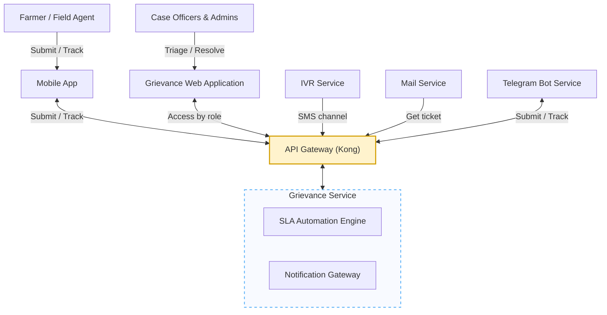

---

## 2.1 — Service Category, Department & SLA Configuration

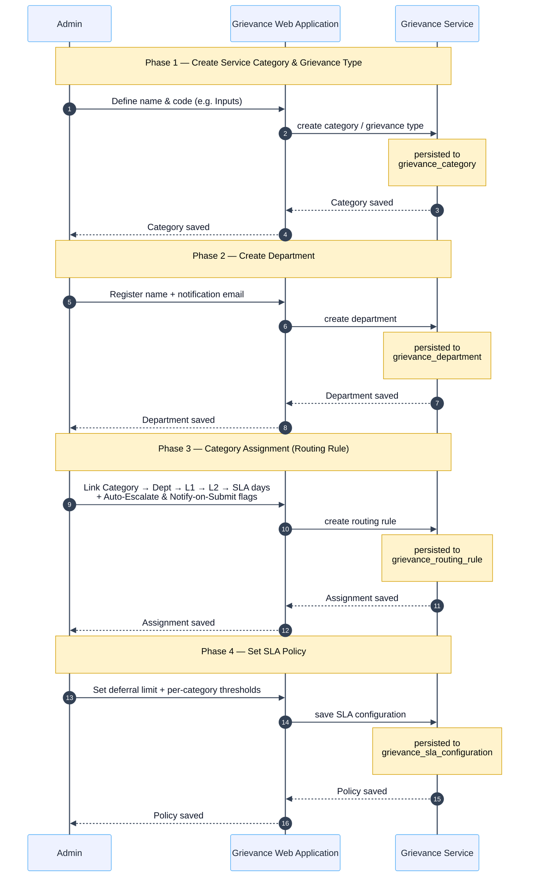

---

## 2.2 — Officer Onboarding (L1 / L2 / Department Head)

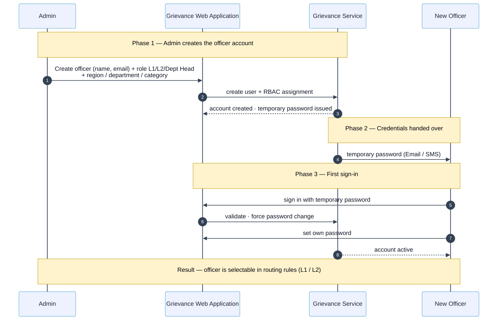

---

## 2.3 — Grievance Submission → Resolution

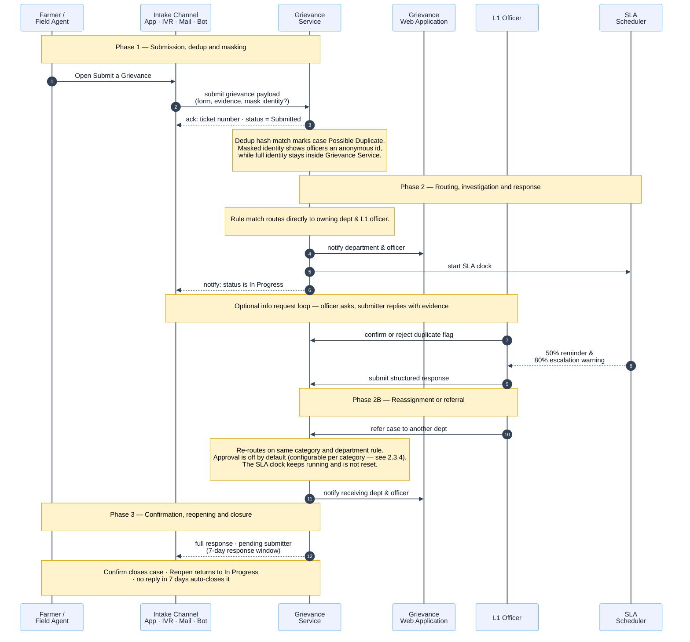

---

## 2.3.1 — Triage outcomes: routing, the manual queue and rejection

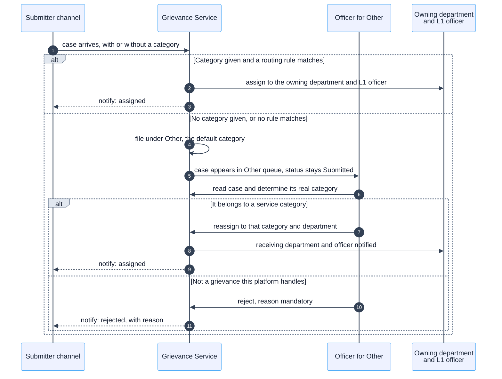

---

## 2.3.2 — The More Info Needed loop

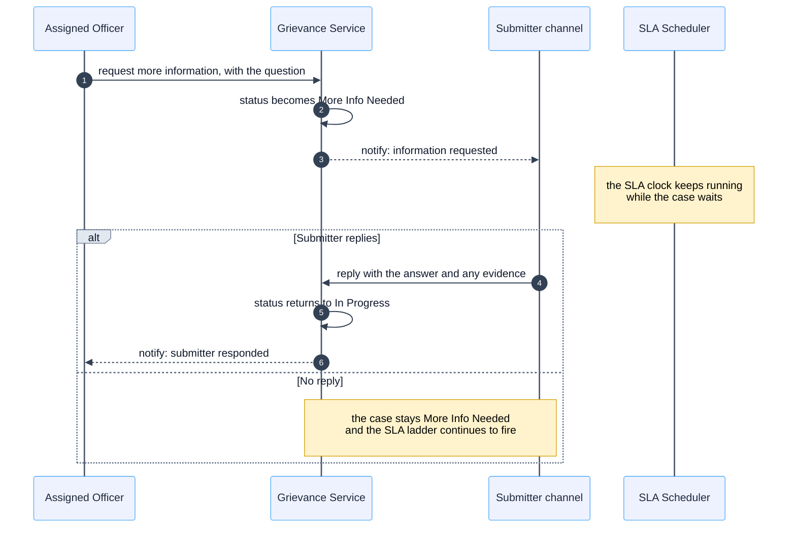

---

## 2.3.3 — Duplicate review

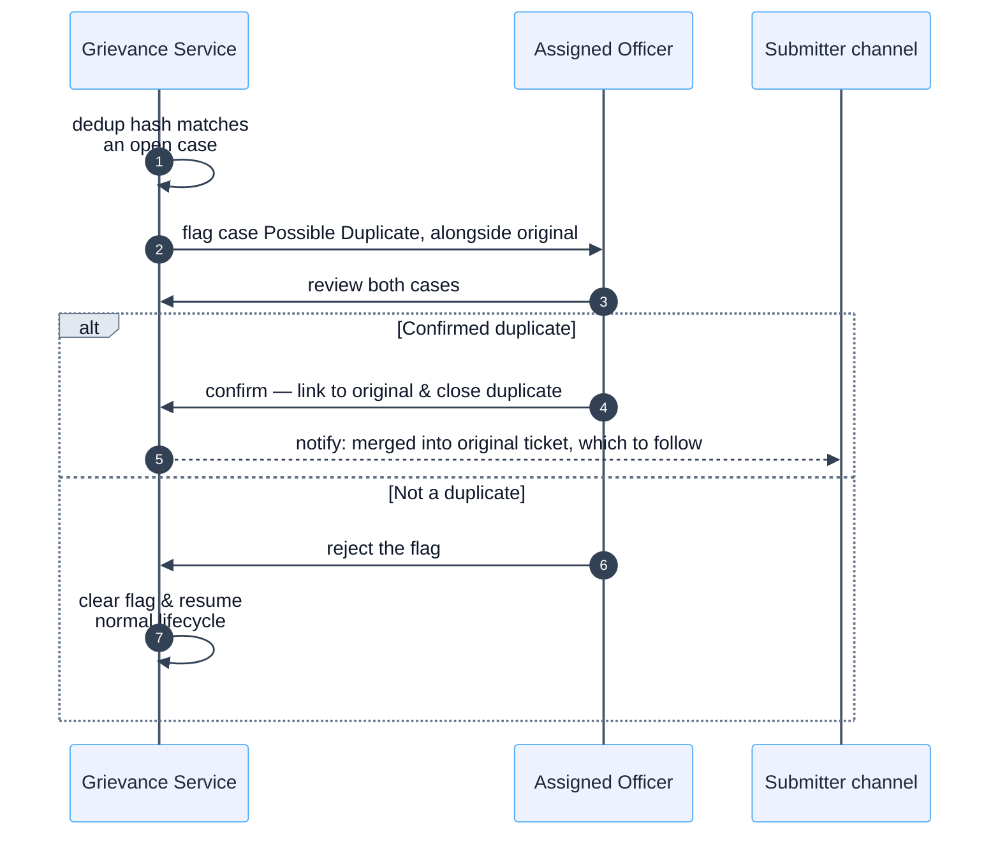

---

## 2.3.4 — Referral and reassignment

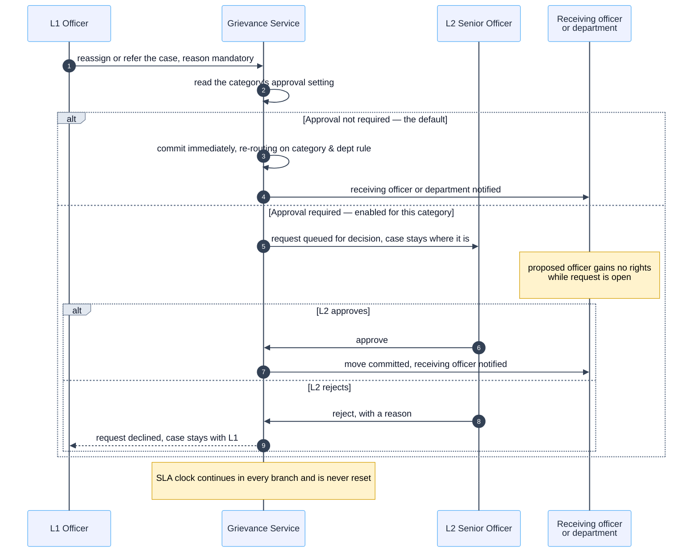

---

## 2.3.5 — The SLA ladder and escalation

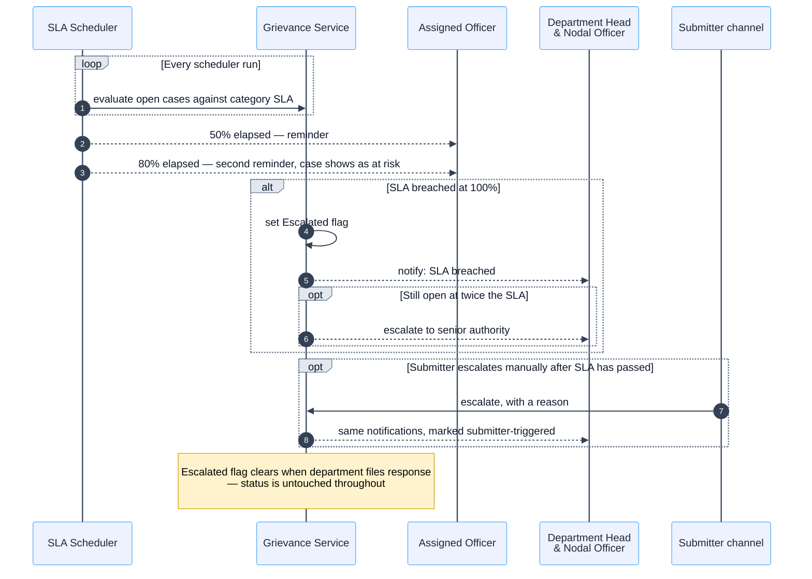

---

## 2.3.6 — Closure: confirm, reopen, or the window expiring

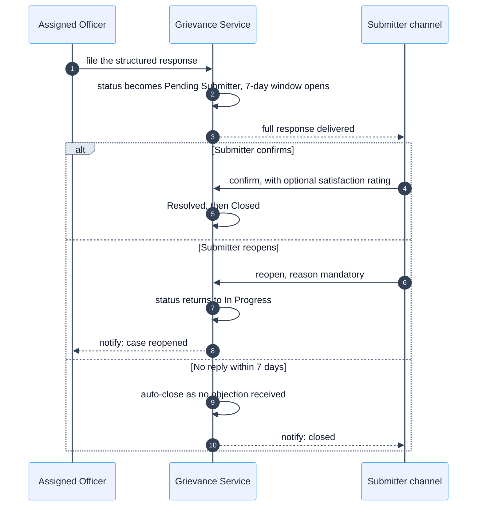

---

## 2.3.7 — Attachment upload and scan verdict

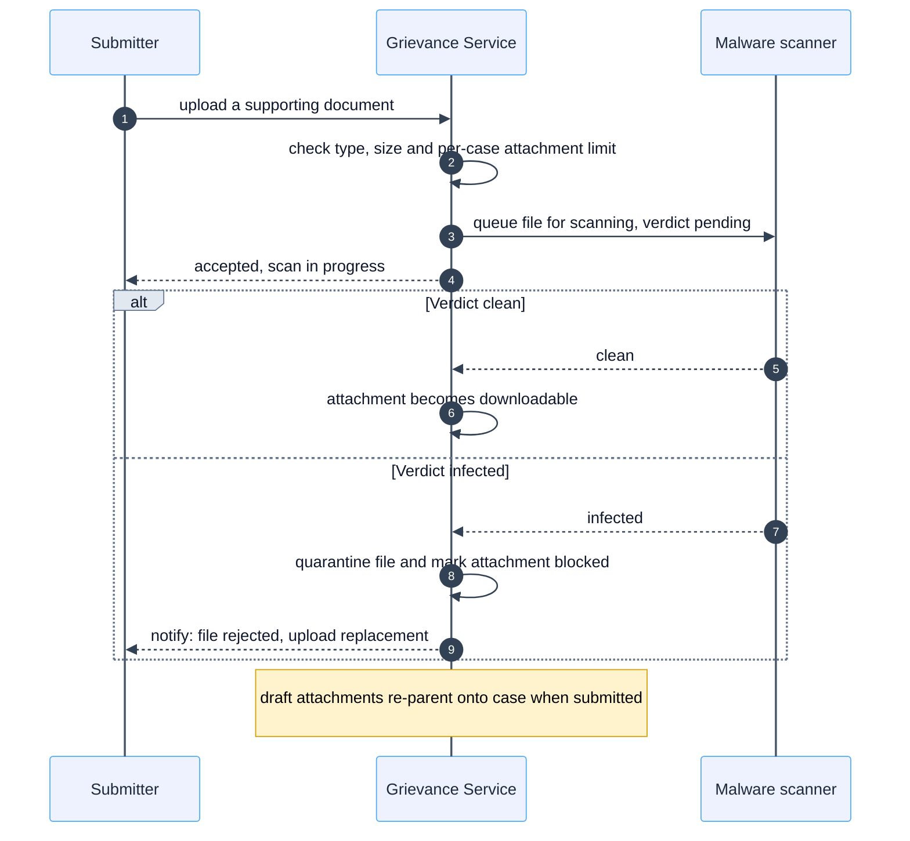

---

## 2.3.8 — Anonymity

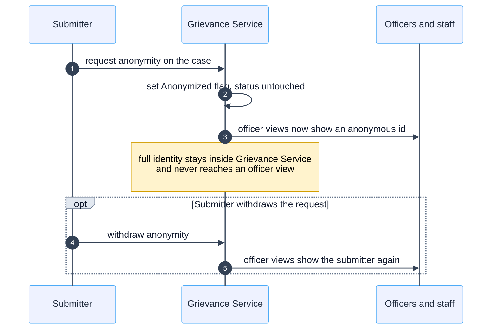
