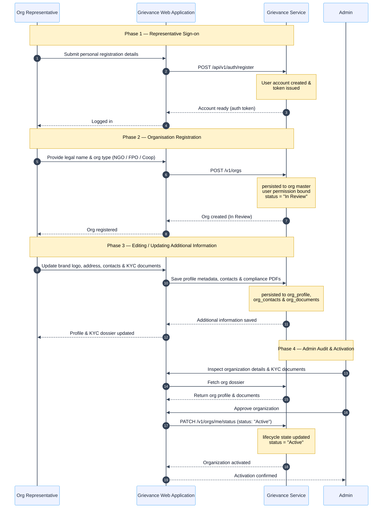

An organisation representative can onboard their entity (NGO, FPO, or cooperative) so it can operate on the platform and manage collective workflows.

## 2.3.9 — Organisation Onboarding (NGO / FPO / Cooperative)

### Endpoints & Access Matrix

| Method  | Path                    | Access            | Purpose                                                                                                                                                                  |
| :------ | :---------------------- | :---------------- | :----------------------------------------------------------------------------------------------------------------------------------------------------------------------- |
| `POST`  | `/api/v1/auth/register` | `Public`          | Register a personal account — the route an organization representative uses before requesting an organization account. (Not a path a farmer or Development Agent takes). |
| `POST`  | `/v1/orgs`              | `Registered User` | Registers a new organization, creates user permission binding, and sets status to`"In Review"`.                                                                          |
| `GET`   | `/v1/orgs/me`           | `Registered User` | Retrieves caller’s organization details, brand info, address, compliance contacts, and KYC status.                                                                       |
| `PATCH` | `/v1/orgs/me`           | `Registered User` | Updates organization profile, registered address, brand name, website, and logo reference.                                                                               |
| `POST`  | `/v1/orgs/images`       | `Registered User` | Uploads public PNG/JPEG/WebP images (max 5MB) for brand logos.                                                                                                           |
| `POST`  | `/v1/orgs/me/documents` | `Registered User` | Uploads private PDF regulatory and KYC compliance documents.                                                                                                             |
| `GET`   | `/v1/orgs/me/documents` | `Registered User` | Streams/downloads the private KYC document (`?view=1` for inline display).                                                                                               |
| `PUT`   | `/v1/orgs/me/contacts`  | `Registered User` | Sets organization contacts (compliance, operational, emergency).                                                                                                         |
| `GET`   | `/v1/orgs/`             | `Admin`           | Retrieves all organization details, brand info, address, compliance contacts, and KYC status.                                                                            |
| `GET`   | `/v1/orgs/{org-name}`   | `Admin`           | Retrieves specific organization details, brand info, address, compliance contacts, and KYC status.                                                                       |
| `PATCH` | `/v1/orgs/me/status`    | `Admin`           | Platform operator action to transition lifecycle (`In Review` $\rightarrow$ `Active` / `Suspended`).                                                                     |

---

Organisation onboarding is an administrative gate before active participation. It binds the representative's account to the entity, gathers compliance assets and private KYC documentation, and holds the organisation In Review until a platform administrator audits the dossier and transitions it to Active.
