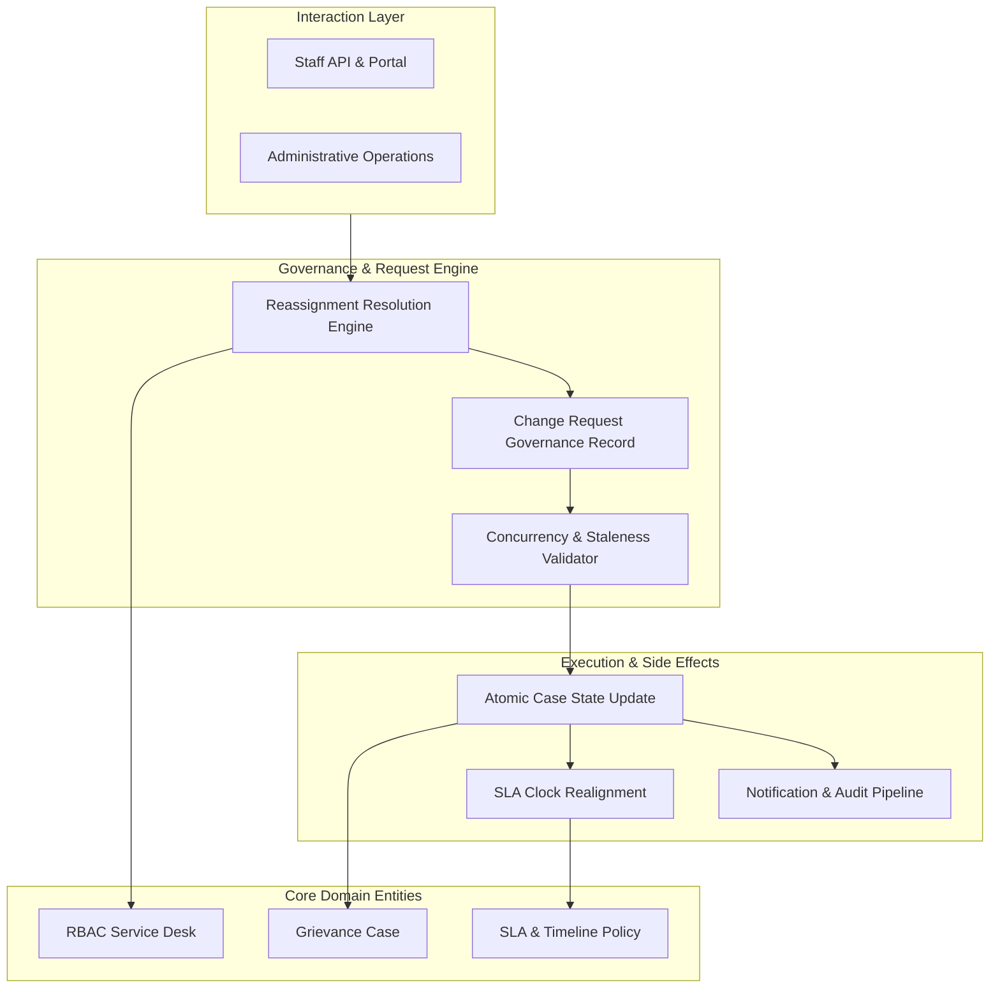
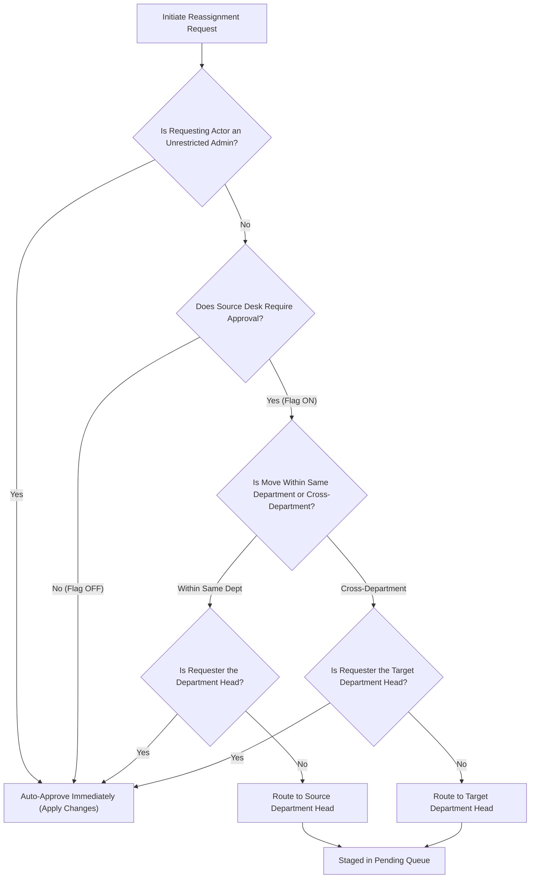
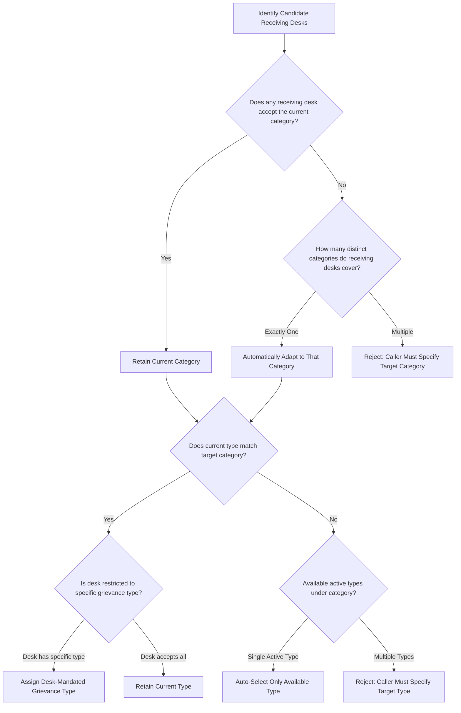
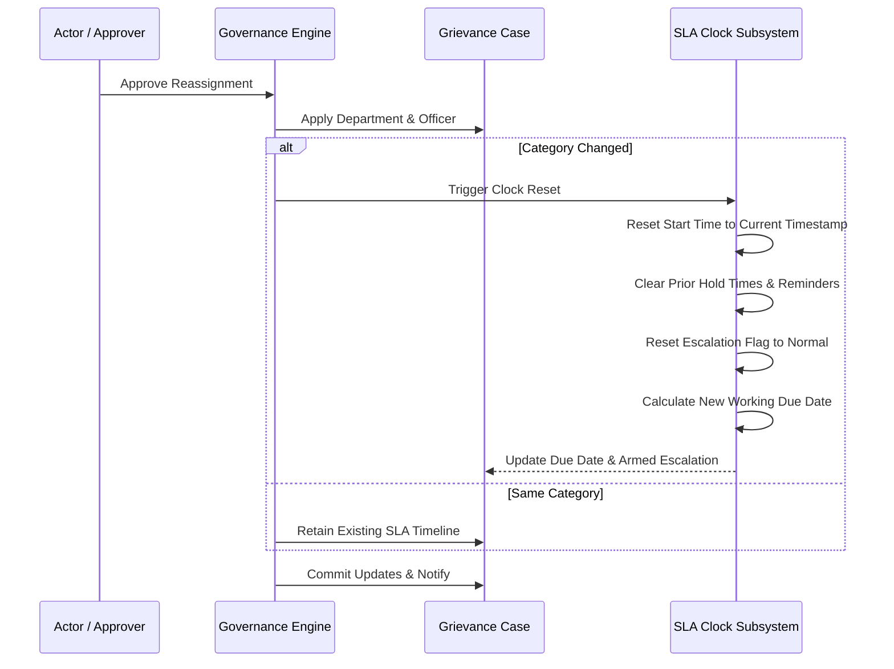
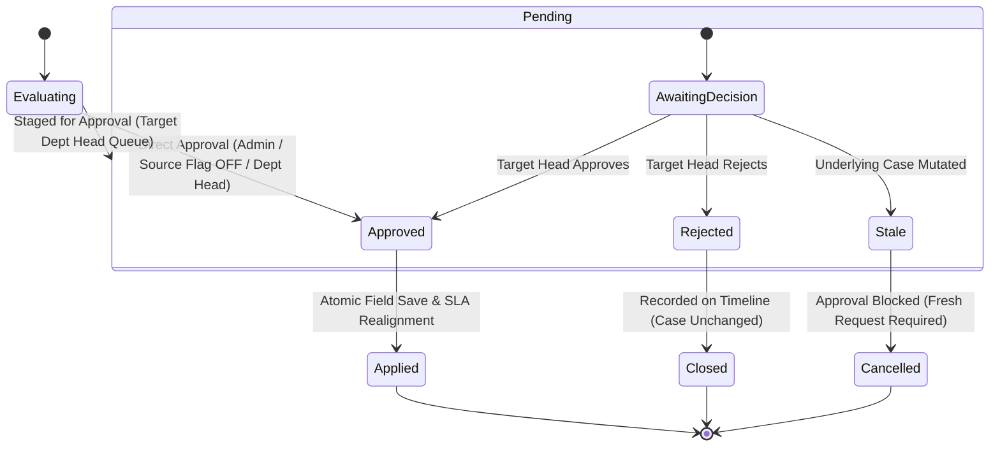

# Governed Grievance Reassignment Architecture

## 1. Executive Summary & Context

In a multi-department public grievance redressal ecosystem, reassigning cases between staff officers or across distinct administrative departments represents a critical control boundary. Historically, informal workflows allow "ticket dumping" across departmental walls without mutual consent, or permit officers to arbitrarily reassign cases without supervision.

This architecture establishes a **Governed Reassignment Protocol** founded on three core tenets:

1. **Receiving Department Authority:** A case cannot be transferred to another department without the explicit consent of the **receiving department's leadership**. No department head can unilaterally push work onto an external department.
2. **Desk-Level Configurable Autonomy:** Approval requirements are managed dynamically at the service desk level. Administrative units can operate in autonomous direct-handoff mode or in supervised-approval mode based on operational maturity.
3. **Coordinated Scope & SLA Realignment:** Reassignment is not merely a label change. It aligns the grievance's service classification, specific grievance sub-type, operational desk, and SLA timeline to the target department's operational mandate.

---

## 2. High-Level System Architecture & Domain Model

### Core Domain Entities

- **Grievance Case:** The central record tracking citizen submissions, geographical jurisdiction, classification (category and grievance type), current assignment (assigned department and officer), workflow state, and SLA timeline.
- **RBAC Service Desk:** The organizational work unit defining jurisdiction (geographic area and department), accepted subject scope (category and grievance type filters), assigned officer ranks, and operational policies.
- **Change Request Governance Record:** An immutable audit and staging document capturing proposed field modifications, snapshotted initial values, routing metadata, approval status, and justification trails.
- **SLA Configuration:** Defines expected resolution timeframes, escalation milestones, working calendar schedules, and clock management behaviors.

---

## 3. Core Governance & Reassignment Rules

### 1. The Receiving Department's Approval

- Moving a grievance within a department requires the approval of that **department's head**.
- Moving a grievance across departments requires the approval of the **receiving (target) department's head**.
- A department head has direct executive authority **only within their own department**. They cannot reassign a case to an external department without the target department head's explicit acceptance.

### 2. Desk-Level Configurable Autonomy

- Approval enforcement is configured on the **source RBAC desk** (`reassignment_requires_approval`).
- **Flag OFF:** Any officer on that desk can reassign cases directly, including across departmental lines. The transfer applies immediately upon submission while retaining full audit tracking and notification dispatch.
- **Flag ON (Default Safe Setting):** Reassignment requests must follow the formal approval route and be decided by the receiving department head or an unrestricted administrator.

### 3. Actor Authority & Role Levels

- **Unrestricted Administrators:** Bypass approval constraints, acting directly on any department and case.
- **Department Head:** Evaluated dynamically as the officer holding the top active leadership rank covering the target department and the grievance's administrative jurisdiction.
- **Self-Approval Prohibition:** A requester can never approve their own pending change request, ensuring separation of duties.

---

## 4. Dynamic Scope Alignment (Category & Type Resolution)

When transferring a grievance to a new department or officer, the case must conform to what the receiving desk is chartered to handle.

1. **Category Inheritance:**

   - If any candidate desk in the target department handles the case's current category, the category is preserved.
   - If candidate desks handle exactly one alternative category, the grievance automatically transitions to that category.
   - If candidate desks handle multiple alternative categories, the system refuses automatic guessing and demands an explicit target category selection.

2. **Grievance Type Inheritance:**

   - If receiving desks enforce a specific grievance sub-type, that type is applied.
   - If the current grievance sub-type remains valid under the resolved category, it is preserved.
   - If the category changes and multiple active sub-types exist, the caller must specify the target type.

3. **Officer Selection:**
   - If a specific target officer is nominated, the system validates their coverage on a candidate desk.
   - If no officer is named, the department's primary or round-robin routing strategy automatically designates the primary officer.

---

## 5. SLA Clock Management & Reset Protocol

Reassignment affects resolution timelines depending on whether the service classification changes:

| Reassignment Scenario                         | SLA Due Date Impact           | SLA Elapsed Clock | Escalation Status             |
| :-------------------------------------------- | :---------------------------- | :---------------- | :---------------------------- |
| **Intra-Department Handoff** (Same Category)  | Preserved                     | Preserved         | Preserved                     |
| **Cross-Department Transfer** (Same Category) | Preserved                     | Preserved         | Preserved                     |
| **Category Reclassification** (Any Transfer)  | **Recalculated from Scratch** | **Reset to Zero** | **Cleared (`escalated = 0`)** |

- **Rationale:** A transfer caused by misclassification assigns responsibility for a different type of service. The new department and assignee are held accountable to a fresh working SLA schedule rather than inheriting a depleted or breached clock caused by another department's delay.

---

## 6. Request Lifecycle & Concurrency Protection

All reassignments follow a strict state machine with active concurrency protection:

### Staleness & Optimistic Concurrency Protocol

- When a change request is created, it captures an immutable snapshot of all target fields in their current state (`old_value`).
- During approval review, the system verifies that the current state of the grievance matches the snapshotted values.
- If another officer, administrator, or workflow action altered the assignment, category, or status in the interim, the request is flagged as **stale**. The approval is safely rejected to prevent overwriting intermediate decisions.

---

## 7. Security, Auditing & Notification Architecture

1. **Dedicated Entry Points:**

   - Generic, unvalidated multi-field modification endpoints are disallowed.
   - Case changes must originate from dedicated domain endpoints (`reassign`, `defer-sla`, `anonymity`) or controlled internal desk forms.

2. **Immutable Audit Trail:**

   - Every change request writes to the chronological case timeline upon creation, approval, or rejection.
   - Cryptographic status histories and audit logs capture who made the request, the approving authority, operational reasons, and before-and-after state diffs.

3. **Multi-Channel Notification Dispatch:**
   - **On Staging (`Pending`):** Notification dispatched to the designated approving department head.
   - **On Completion (`Applied`):** Real-time assignment notifications dispatched to the incoming officer and the receiving department dispatch queue.
